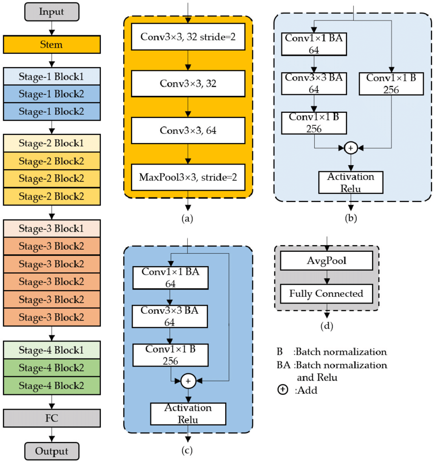
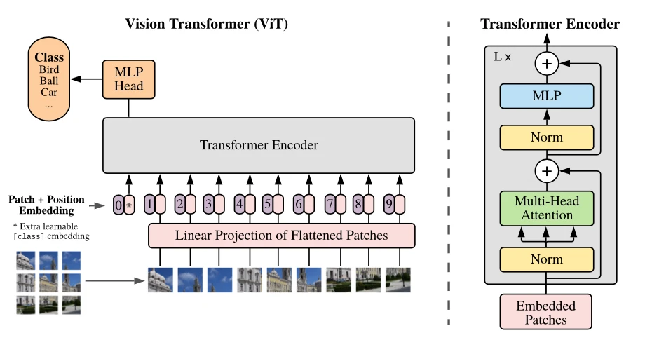

# 图像识别
## 网络结构
### Resnet50 结构图

### ViT Transformer 结构图

## 实验和实验结果
### 数据集
CIFAR-10 batchsize=128

### 网络
vit/tiny:  patchsize:4 dim=128 depth=3, heads=64, mlp_dim=256 params=12798858
vit/base:  patchsize:4 dim=128 depth=3, heads=64, mlp_dim=256 params=12798858
resnet50:  params=23528522

### 实验
优化器：sgd(learning_rate=1e-3, weight_decay=1e-4, momentum=0.9)
在图像增广前，ViT/tiny训练200轮, Resnet50使用预训练权重在CIFAR-10上微调100轮：
